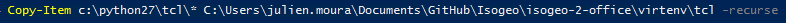
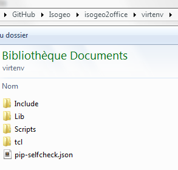

isogeo2office
======

Desktop toolbox using Isogeo REST API to export metadatas into Microsoft Office files.

## Requirements

* Windows Operating System (Unix should work too but has not been tested)
* Internet connection
* rights to write on the output folder
* Python 2.7.9+ installed and added to the environment path
* Python SetupTools and Pip installed (see: [get setuptools and pip on Windows](http://docs.python-guide.org/en/latest/starting/install/win/#setuptools-pip))
* [Microsoft Visual C++ Compiler for Python 2.7](https://www.microsoft.com/en-us/download/details.aspx?id=44266)
* software able to read output files (*.docx, *.xlsx)
* an Isogeo account (admin or 3rd party developer)

## Quick installation and launch

1. Clone or download this repository ;
2. Open a command prompt in the folder and launch `pip install -r requirements.txt`. If you are on a shared machine with various tools related to Python, it's higly recomended to use a virtual environment. See: Python Virtualenvs on Windows and a [Powershell wrapper](https://bitbucket.org/guillermooo/virtualenvwrapper-powershell/) ;
3. Edit the *settings.ini* file and custom it with your informations. At less, you have to set *app_id* and *app_secret* with your own values. If you are behind a proxy, you should set the parameters too. ;
4. Launch **isogeo2office.py**

## Usage

* as Isogeo administrator, select metadatas catalogs that you want to export sharing them with [APP](https://app.isogeo.com/admin/shares) ;
* create your own Word template respecting the syntax `{{ varOwner }}` ;


## Detailed deployment

1. Download and install the last Python 2.7.x version (64bits version is recomended except if you use Python with incompatibilty like arcpy): https://www.python.org/downloads/windows ;
2. Add Python to the environment path, with the System Advanced Settings or with *powershell* typing `[Environment]::SetEnvironmentVariable("Path", "$env:Path;C:\Python27\;C:\Python27\Scripts\", "User")` ;
3. Download [get_pip.py](https://bootstrap.pypa.io/get-pip.py) and execute it from a *powershell* prompt as administrator: `python get_pip.py` ;
4. Download the repository, open an **admin** *powershell* inside and execute: `pip install virtualenv` ;
5. Execute: `set-executionpolicy RemoteSigned` to allow powershell advanced scripts. ;
6. Create the environment: `virtualenv virtenv --no-site-packages` ;
7. Activate it: `.\virtenv\Scripts\activate.ps1`. Your prompt should have changed. ;
8. Get the dependencies, choosing between 32/64 bits versions: `pip install -r requirements_32bits.txt` or `pip install -r requirements_64bits.txt` ;
9. Assuming you have installed Python in C:\Python27\, copy the *tcl* folder from C:\Python27\ over to the root of the new virtenv (see: http://stackoverflow.com/a/30377257). Avoiding this error: "This probably means that tk wasn't installed properly.". You can do that from your admin powershell prompt executing: `Copy-Item -Path c:\python27\tcl\* -Destination {absolute_path_to_the_folder}\isogeo-2-office\virtenv\tcl -recurse -Container: $true`:

	

	Your virtenv folder should look like this:

	


## Tips

### Shortcut

Create a Windows shortcut: Right clic > New > Shortcut and insert this command replacing with the absolute paths (removing brackets): `C:\Windows\System32\cmd.exe /k "{absolute_path_to_the_folder}\isogeo2office\virtenv\Scripts\python {absolute_path_to_the_folder}\isogeo2office\isogeo2office.py"`

## Scheduled task

Program/script:

`{absolute_path_to_the_folder}\virtenv\Scripts\python.exe`

Arguments:

`{absolute_path_to_the_folder}\isogeo2office.py`

Launch in :

`{absolute_path_to_the_folder}\`

## Localization

It uses `.pot`, `.po` and `.mo`files to manage translations with [Python gettext implementation](https://docs.python.org/2/library/gettext.html#internationalizing-your-programs-and-modules).

`.pot`file generated with:

```batch
python C:\Python27\Tools\i18n\pygettext.py -d i18n\isogeo2office isogeo2office.py .\modules\ui_app_settings.py
```

`.po`and `.mo` files edited and made with [POEdit](https://poedit.net/).

## Windows executable

To generate it:

1. Open a prompt command and enter into the virtual environment ;
2. Add development requirements: `pip install -r requirements_dev.txt` ;
3. Run: `pyinstaller isogeo2office.spec`

The one-folder executable is located in *dist* folder.

## Support

This application is not part of Isogeo license contract and won't be supported or maintained as well. If you need help, send a mail to <projets+isogeo2office@isogeo.fr>
